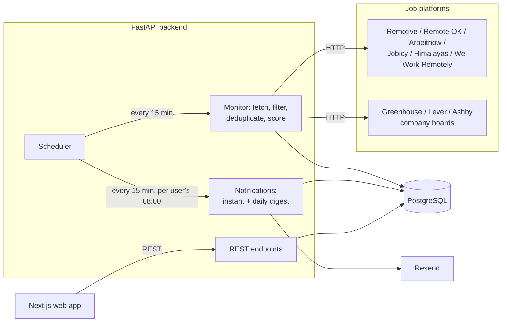

# System design

JobForge has three parts: a Next.js web app, a FastAPI backend with a
built-in scheduler, and a PostgreSQL database. Email goes out through
Resend.

## Scheduler

APScheduler runs inside the API process, on UTC:

| Job | When | What it does |
| --- | --- | --- |
| `jobforge_monitor` | Every 15 minutes, first run at startup | Scans for new jobs, then sends instant emails |
| `jobforge_daily_digest` | Every quarter hour | Sends the digest to users whose local time has passed `DIGEST_HOUR:DIGEST_MINUTE` and who haven't had one today |

The scheduler must run in exactly one process. Running the API with more
than one worker would scan and send emails more than once.

## One monitoring cycle

1. Build search criteria from all career profiles: the job titles become
   search queries, and the specific title words and skills become
   relevance keywords.
2. For each source in `JOB_SOURCES` that is due (each source has a minimum
   interval: Remotive 6 hours, Arbeitnow 1 hour, others every cycle):
   fetch, drop irrelevant jobs from broad feeds, and ingest.
3. Ingestion updates jobs already seen (same fingerprint), skips jobs
   another platform already supplied (same dedupe key), and stores the
   rest as new.
4. Score each new job against every profile and create matches.
5. Create a notification for each match that is in the candidate's field
   and scores at least `NOTIFICATION_MIN_SCORE` (60): `immediate` at 89+,
   otherwise `digest`, subject to the user's preferences.
6. Send pending instant notifications, one email per user per cycle.

A failure in one source is logged and doesn't stop the others.

## Scoring

Each factor is scored only if the job states it, then the total is scaled
to 100:

| Factor | Weight |
| --- | --- |
| Job title | 25 |
| Skills | 30 |
| Experience | 15 |
| Work type | 10 |
| Location / remote eligibility | 10 |

Caps:

- **49:** the candidate can't take the job (outside the countries a job
  accepts, or an unpaid/volunteer role).
- **89:** a remote job that doesn't say which countries it accepts, or a
  job with no recognisable skills.

Salary appears in the match reasons, compared in the profile's currency
and period, but never changes the score.

## Email delivery

Failed deliveries are retried on later cycles up to
`NOTIFICATION_MAX_ATTEMPTS` times, then marked `failed`. Notifications not
emailed because of a user's preferences are marked `skipped` and never
retried.
