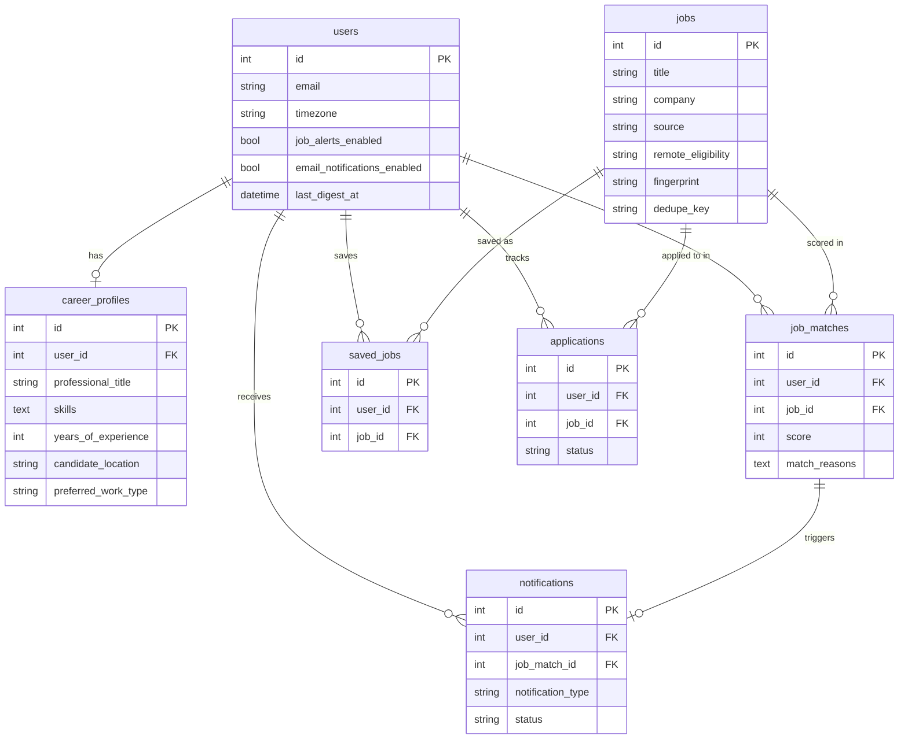

# Entity relationship diagram

See [schema.md](schema.md) for every column.

```mermaid
erDiagram
    users ||--o| career_profiles : has
    users ||--o{ job_matches : has
    users ||--o{ notifications : receives
    users ||--o{ saved_jobs : saves
    users ||--o{ applications : tracks

    jobs ||--o{ job_matches : "scored in"
    jobs ||--o{ saved_jobs : "saved as"
    jobs ||--o{ applications : "applied to in"

    job_matches ||--o| notifications : triggers

    users {
        int id PK
        string email
        string timezone
        bool job_alerts_enabled
        bool email_notifications_enabled
        datetime last_digest_at
    }

    career_profiles {
        int id PK
        int user_id FK
        string professional_title
        text skills
        int years_of_experience
        string candidate_location
        string preferred_work_type
    }

    jobs {
        int id PK
        string title
        string company
        string source
        string remote_eligibility
        string fingerprint
        string dedupe_key
    }

    job_matches {
        int id PK
        int user_id FK
        int job_id FK
        int score
        text match_reasons
    }

    notifications {
        int id PK
        int user_id FK
        int job_match_id FK
        string notification_type
        string status
    }

    saved_jobs {
        int id PK
        int user_id FK
        int job_id FK
    }

    applications {
        int id PK
        int user_id FK
        int job_id FK
        string status
    }
```
